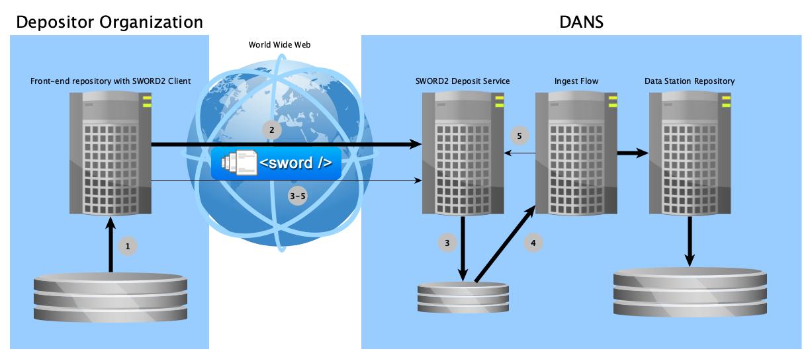

dd-dans-sword2-examples
=======================

Examples for creating a SWORD2 Java client to deposit datasets to a DANS Data Station

SYNOPSIS
--------

```text
mvn clean install
./run-validation.sh https://demo.sword2.domain.datastations.nl/validate-dans-bag bag
./run-deposit.sh Simple https://demo.sword2.domain.datastations.nl/collection/1 myuser mypassword bag
./run-deposit.sh Continued https://demo.sword2.domain.datastations.nl/collection/1 myuser mypassword chunksize bag
./run-deposit.sh SequenceSimple https://demo.sword2.domain.datastations.nl/collection/1 myuser mypassword bag1 bag2 bag3
./run-deposit.sh SequenceContinued https://demo.sword2.domain.datastations.nl/collection/1 myuser mypassword chunksize bag1 bag2 bag3
```

DESCRIPTION
-----------
This project contains two important resources for developers who are tasked with the creation or maintenance of a SWORD2 client that deposits datasets to one of
the DANS Data Stations (or the DANS Vault Service):

* Example Java client code
* Examples of bags that conform to the [DANS BagIt Profile v1]{:target=_blank} requirements (and&mdash;for illustration&mdash;some that violate some of the
  requirements).

!!! attention "Looking for legacy EASY SWORD2 examples?"

    This project contains examples for the SWORD2 interface of the new **DANS Data Stations**. For the _legacy EASY SWORD2 service_ see 
    [easy-sword2-dans-examples]{:target=_blank}. 

!!! attention "Migrating from EASY SWORD2 to Data Station SWORD2"

    If you are an existing customer who is migrating an EASY SWORD2 client to a Data Station SWORD2 client, please read
    [Migrating from EASY]{:target=_blank} after you have read the current page.   

### SWORD2 in a nutshell

Depositing to the DANS Archive via SWORD2 is basically a two-phase process:

1. Submitting a deposit for ingest.
2. Tracking the state of the deposit as it goes through the ingest-flow, until it reaches PUBLISHED status.

The following diagram details this a bit further.



1. Client creates a deposit package (conforming to [DANS BagIt Profile v1]{:target=_blank}).
2. Client sends deposit package to SWORD2 Service, getting back a URL to track the deposit's state.
3. SWORD2 Service unzips and validates deposit.
4. Ingest Flow performs checks and transformations and creates a dataset in the Data Station Repository.
5. Ingest Flow reports back success or failure to SWORD2 Service.

3-5. During this time the Client periodically checks the deposit state through the URL received in step 2.
If the final state of `PUBLISHED` is reached, the process is concluded successfully. At this point the deposit has created a new dataset (or a new version
of an existing dataset) in the Data Station repository. Other outcomes may be `INVALID` (the bag was [invalid according to the BagIt specs]{:target=_blank})
or `REJECTED` (the additional requirements of [DANS BagIt Profile v1]{:target=_blank} were not met). In case the server encountered an unknown error `FAILED`
will be returned.

!!! note "SWORD2 service description"

    More detailed information about the SWORD2 Service can be found [on its manual page]{:target=_blank}. 

[on its manual page]: {{ dd_sword2_docs }}
[invalid according to the BagIt specs]: https://www.rfc-editor.org/rfc/rfc8493#section-3

### Getting started

The following is a step-by-step instruction on how to run a simple example using the Data Station's demo server.

#### Getting access to the demo server

!!! note "Agreement"

    Before you can get access to the demo server, there must be a formal agreement between your organization and DANS. The following assumes that this agreement 
    is in place. If it is not, please contact the Data Station Manager of the [Data Station](http://dans.knaw.nl){:target=_blank} that you want to deposit to.

1. From your Data Station Manager at DANS request access to the demo Data Station server. The Data Station Manager will provide the information necessary to
   connect.
2. Create an account in the demo Data Station.
3. From your Data Station Manager at DANS request the account to be enabled for SWORD2 deposits.

!!! note "Configuring which notifications to receive"

    The Data Station repository (Dataverse) generates [notifications]{:target=\_blank} for many events. Most of these can be muted. Log in via the user interface
    and open the account menu on the top right. Click on the _Notifications_ item. The _Notifications_ tab of your _Account_ page will now be opened. Expand the 
    header _Notification settings_ and uncheck the notification types you do not wish to receive.

[notifications]: https://guides.dataverse.org/en/latest/user/account.html#notifications

#### Depositing your first dataset

##### Running the SimpleDeposit example

1. Clone and build this project:

        git clone https://github.com/DANS-KNAW/dd-dans-sword2-examples
        cd dd-dans-sword2-examples
        mvn clean install

3. Execute the following command from the base directory of your clone:

        ./run-deposit.sh Simple https://demo.<domain>.datastations.nl/sword2/collection/1 <user> <password> <bag>
   Fill in:

    * for `<domain>` the name of the Data Station that you are depositing to, one of `archaeology`, `ssh`, `lhms`
      or `pts`;
    * for `<user>` your Data Station account name;
    * for `<password>` the password of your Data Station account;
    * for `<bag>`: any of the bags in `src/main/resources/example-bags`, for example
      `src/main/resources/example-bags/valid/audiences`.

   This will run the example program `nl.knaw.dans.sword2examples.SimpleDeposit`, which will copy the example bag to the
   folder `target` (the Maven build folder), zip it and send it to `https://demo.<domain>.datastations.nl/sword2/collection/1`
   authenticating with the provider username and password using basic auth.

!!! note "Authenticating with X-Dataverse-key"

    Instead of using username and password you can also authenticate using your API-token (also known as API-key). You can look up you current current 
    API-token in your account settings in the Data Station user interface. The API-token is specified using the header `X-Dataverse-key`. To pass it to 
    the example programs using the `run-deposit.sh` script specify instead of your user name the literal string `API_KEY` and instead of your password
    the API-token.


##### Output analysis

[In the introduction](#sword2-in-a-nutshell) the SWORD2 deposit process is described in 5 stages, the response messages give some indication how far the
process has progressed. The output will take the following form, starting with the part of the response representing step 2. The UUID will of course be
different.

```text
 SUCCESS. Deposit receipt follows:
 <entry xmlns="http://www.w3.org/2005/Atom">
     <generator uri="http://www.swordapp.org/" version="2.0" />
     <id>https://demo.sword2.<domain>.datastations.nl/container/a5bb644a-78a3-47ae-907a-0bdf162a0cd4</id>
     <link href="https://demo.sword2.<domain>.datastations.nl/container/a5bb644a-78a3-47ae-907a-0bdf162a0cd4" rel="edit" />
     <link href="https://demo.sword2.<domain>.datastations.nl/container/a5bb644a-78a3-47ae-907a-0bdf162a0cd4" rel="http://purl.org/net/sword/terms/add" />
     <link href="https://demo.sword2.<domain>.datastations.nl/media/a5bb644a-78a3-47ae-907a-0bdf162a0cd4" rel="edit-media" />
     <packaging xmlns="http://purl.org/net/sword/terms/">http://purl.org/net/sword/package/BagIt</packaging>
     <link href="https://demo.sword2.<domain>.datastations.nl/statement/a5bb644a-78a3-47ae-907a-0bdf162a0cd4" rel="http://purl.org/net/sword/terms/statement" type="application/atom+xml; type=feed" />
     <treatment xmlns="http://purl.org/net/sword/terms/">[1] unpacking [2] verifying integrity [3] storing persistently</treatment>
     <verboseDescription xmlns="http://purl.org/net/sword/terms/">received successfully: bag.zip; MD5: 494dd614e36edf5c929403ed7625b157</verboseDescription>
 </entry>
 Retrieving Statement IRI (Stat-IRI) from deposit receipt ...
 Stat-IRI = https://demo.sword2.<domain>.datastations.nl/statement/a5bb644a-78a3-47ae-907a-0bdf162a0cd4
```

As the deposit is being processed by the server the client polls the Stat-IRI to track the status of the deposit. During this stage steps 3 and 4 are performed.

```text
 Start polling Stat-IRI for the current status of the deposit, waiting 10 seconds before every request ...
 Checking deposit status ... SUBMITTED
 Checking deposit status ... SUBMITTED
 Checking deposit status ... SUBMITTED
 Checking deposit status ... SUBMITTED
```

The 5th and final step of the process is represented by the following response messaging.

```text
Checking deposit status ... PUBLISHED
SUCCESS. 
Dataset has been published as: <https://doi.org/doi:10.5072/DAR/MNGAHF>. 
Dataset NBN: <https://www.persistent-identifier.nl?identifier=urn:nbn:nl:ui:13-d4cfb364-c6cc-4242-891a-e9e9673379bc>. 
Bag ID for this version of the dataset: urn:uuid:ca145147-6d15-4c2b-abf0-fb1110271560
State description: The deposit was successfully ingested in the Data Station and will be automatically archived
Complete statement follows:
<?xml version="1.0" encoding="UTF-8" standalone="yes"?>
<feed xmlns="http://www.w3.org/2005/Atom" xmlns:sword="http://purl.org/net/sword/terms/" xmlns:ns3="http://purl.org/net/sword/">
    <id>https://demo.sword2.<domain>.datastations.nl/statement/ca145147-6d15-4c2b-abf0-fb1110271560</id>
    <link href="https://demo.sword2.<domain>.datastations.nl/statement/ca145147-6d15-4c2b-abf0-fb1110271560" rel="self"/>
    <title type="text">Deposit ca145147-6d15-4c2b-abf0-fb1110271560</title>
    <author>
        <name>DANS SWORD2</name>
    </author>
    <updated>2023-02-18T12:03:55.966061+01:00</updated>
    <entry>
        <id>urn:uuid:ca145147-6d15-4c2b-abf0-fb1110271560</id>
        <title type="text">Resource urn:uuid:ca145147-6d15-4c2b-abf0-fb1110271560</title>
        <summary type="text">Resource Part</summary>
        <content src="urn:uuid:ca145147-6d15-4c2b-abf0-fb1110271560" type="multipart/related"/>
        <updated>2023-02-18T12:04:06.251424+01:00</updated>
        <link href="https://doi.org/doi:10.5072/DAR/MNGAHF" rel="self"/>
        <link href="https://www.persistent-identifier.nl?identifier=urn:nbn:nl:ui:13-d4cfb364-c6cc-4242-891a-e9e9673379bc" rel="self"/>
    </entry>
    <category label="State" scheme="http://purl.org/net/sword/terms/state" term="PUBLISHED">The deposit was successfully ingested in the Data Station and will be automatically archived</category>
</feed>
```

How to read this output?

* This confirms that the dataset was succesfully published and is resolvable using the DOI URL <https://doi.org/doi:10.5072/DAR/MNGAHF>. (N.B. in the test
  environment the DOI will not actually resolve.) The DOI can be used to cite the dataset.
* The dataset has the URN:NBN identifier `urn:nbn:nl:ui:13-d4cfb364-c6cc-4242-891a-e9e9673379bc`. This can be used be the depositor to retrieve a summary from
  the DANS Data Vault for this dataset. The summary includes information about for which dataset versions a long term preservation copy exists in the Vault.
  (N.B. At the time of writing &mdash;February 2023&mdash; the DANS Data Vault is not yet operational.)
* The Bag ID for this **version** of the dataset is `urn:uuid:ca145147-6d15-4c2b-abf0-fb1110271560`. The Bag ID serves as a unique identifier for a long term
  preservation package in the DANS Data Vault.

#### Output for a failed deposit

If you deposit a bag that does not comply with the [BagIt]{:target=_blank} or the [DANS BagIt Profile v1]{:target=_blank} requirements, a state of `REJECTED`
will
be returned. For example, when you use the example bag in `src/main/resources/example-bags/invalid/two-available-dates`, the error will indicate that a second
`ddm:available` element was found where a `ddm:audience` was expected:

```text
Checking deposit status ... REJECTED
FAILURE. Complete statement follows:
<?xml version="1.0" encoding="UTF-8" standalone="yes"?>
<feed xmlns="http://www.w3.org/2005/Atom" xmlns:sword="http://purl.org/net/sword/terms/" xmlns:ns3="http://purl.org/net/sword/">
    <id>https://sword2.dar.dans.knaw.nl/statement/dde565d7-878a-4ae2-a607-0a3f55a22630</id>
    <link href="https://sword2.dar.dans.knaw.nl/statement/dde565d7-878a-4ae2-a607-0a3f55a22630" rel="self"/>
    <title type="text">Deposit dde565d7-878a-4ae2-a607-0a3f55a22630</title>
    <author>
        <name>DANS SWORD2</name>
    </author>
    <updated>2023-02-18T12:15:02.451030+01:00</updated>
    <entry>
        <id>urn:uuid:dde565d7-878a-4ae2-a607-0a3f55a22630</id>
        <title type="text">Resource urn:uuid:dde565d7-878a-4ae2-a607-0a3f55a22630</title>
        <summary type="text">Resource Part</summary>
        <content src="urn:uuid:dde565d7-878a-4ae2-a607-0a3f55a22630" type="multipart/related"/>
        <updated>2023-02-18T12:15:12.578076+01:00</updated>
    </entry>
    <category label="State" scheme="http://purl.org/net/sword/terms/state"
              term="REJECTED">Rejected /var/opt/dans.knaw.nl/tmp/auto-ingest/inbox/dde565d7-878a-4ae2-a607-0a3f55a22630: Bag was not valid according to Profile Version 1.0.0. Violations: - [3.1.1] metadata/dataset.xml does not conform to dataset.xml:
        - cvc-complex-type.2.4.a: Invalid content was found starting with element '{"http://schemas.dans.knaw.nl/dataset/ddm-v2/":available}'. One of '{"http://schemas.dans.knaw.nl/dataset/ddm-v2/":audience}' is expected.
    </category>
</feed>
```

##### Statuses

The deposit will go through a number of statuses.

| State        | Description                                                                                                                                                                                                                                           |
|--------------|-------------------------------------------------------------------------------------------------------------------------------------------------------------------------------------------------------------------------------------------------------|
| `DRAFT`      | The deposit is being prepared by the depositor. It is not submitted to the archive yet <br/> and still open for additional data.                                                                                                                      |
| `UPLOADED`   | The deposit is in the process of being submitted. It is waiting to be finalized. The data<br/> is completely uploaded. It will automatically move to the next stage and the status will <br/> be updated accordingly.                                 | 
| `FINALIZING` | The deposit is in the process of being submitted. It is being checked for validity. It will <br/>  automatically move to the next stage and the status will be updated accordingly.                                                                   |
| `INVALID`    | The deposit is not accepted by the archive as the submitted bag is not valid. <br/>The description will detail what part of the bag is not according to specifications. <br/>The depositor is asked to fix the bag and resubmit the deposit.          |
| `SUBMITTED`  | The deposit is submitted for processing. At this point the Ingest Flow is processing<br/> the deposit and will update the state when it finishes.                                                                                                     |
| `FAILED`     | An error occurred while processing the deposit                                                                                                                                                                                                        | 
| `REJECTED`   | The deposit does not meet the requirements of [DANS BagIt Profile v1]{:target=_blank}. The description<br/> will detail what part of the deposit is not according to specifications. The depositor is<br/> requested to fix and resubmit the deposit. |                         
| `PUBLISHED`  | The deposit is successfully published in the Data Station repository.                                                                                                                                                                                 |                                                                                                                                                                                                      

If an error occurs the deposit will end up INVALID, REJECTED (client errors) or FAILED (server error). The text of the `category` element will contain details
about the error.

### Next steps

#### Studying the example bags

After successfully depositing the first example to the demo repository you can start thinking about how to design your SWORD2 client. Depending on your source
repository system this make take various shapes. In any case your code will need to assemble a bag conforming to [DANS BagIt Profile v1]{:target=_blank}. Some
examples of such bags are included in the [resources directory]{:target=_blank} of this project.

#### Mapping rules

The contents of the bags you deposit are mapped to data files and metadata in Dataverse. The mapping rules are documented in the
[Ingest Flow Mapping Rules]{:target=_blank} Google spreadsheet. If you are a DANS SWORD2 customer access will be granted on request.

#### Finding libraries and tools

* [bagit-java]{:target=_blank}&mdash;a Java library for working with bags. This is a DANS fork of a project started by Library of Congress, which is no longer
  maintained by them.
* [bagit-python]{:target=_blank}&mdash;a Python library and command line tool for working with bags, also by Library of Congress. This is still maintained by
  them.
* `brew install bagit` is still available on MacOS to install an older version of [bagit-java]{:target=_blank} which contained a powerful command line
  interface, but is no longer maintained.
* [xmllint]{:target=_blank}&mdash;a tool to check that XML files conform to a given XML schema.

!!! warning "Abdera project retired"

    [easy-sword2-dans-examples]{:target=\_blank} used the [Apache Abdera]{:target=_blank} library to parse Atom Entry and Feed documents. We have removed that 
    dependency, because Abdera is no longer maintained and we do not recommend using unmaintained libraries. 

#### End-point for DANS BagIt Profile validation

All bags that are deposited to a Data Station are validated by [dd-validate-dans-bag]{:target=_blank} to see if they conform to
[DANS BagIt Profile v1]{:target=_blank}. To facilitate faster development in the demo environment this service can be invoked directly.
The example program [nl.knaw.dans.sword2examples.ValidateBag] demonstrates how to call this API. A helper script to start this program is
also provided, see `run-validation.sh`.

!!! warning "DO NOT make calling this API part of your production code!"

    Use of the validation API end-point is entirely optional during testing. The Ingest Flow will call the validation before further processing a deposit, so if
    it is not valid it *will* be rejected. That having been said, when writing the code that assembles the bag to be deposited, using the validation API end-point
    may shorten the Edit - Compile - Run cycle. 

#### Testing different scenarios

This project contains four [Java example programs]{:target=_blank} which can be used as a guide to writing a custom client to deposit datasets using the SWORD2
protocol. The examples take one or more bags as input parameters. These bags may be directories or ZIP files. The code copies each bag to the `target`-folder of
the project, zips it (if necessary) and sends it to the specified SWORD2 service. The copying step has been built in because in some examples the bag must be
modified before it is sent; this way we avoid changing the git working directory.

1. `SimpleDeposit.java` sends a zipped dataset in a single chunk and reports on the status.
2. `ContinuedDeposit.java` sends a zipped bag in chunks of configurable size and reports on the status.
3. `SequenceSimpleDeposit.java` calls the SimpleDeposit class multiple times to send multiple bags belonging to a sequence, the first bag being a new dataset
   and subsequent bags being updates (new versions) of this dataset.
4. `SequenceContinuedDeposit.java` calls the ContinuedDeposit class multiple times to send multiple bags belonging to a sequence, the first bag being a new
   dataset and subsequent bags being updates (new versions) of this dataset.

The `Common.java` class contains elements which are used by all the other classes. This would include parsing, zipping and sending of files.

The project root directory contains several helper scripts (`run-*.sh`) that can be used to invoke the Java programs. See [SYNOPSIS](#synopsis). These scripts
were developed to run in a `bash` or `zsh` shell, but should be easy to adapt for a different shell environment.

EXAMPLES
--------

* [Java Example programs]{:target=_blank}.
* Example bags can be found in the [resources directory]{:target=_blank}.

BUILDING FROM SOURCE
--------------------
Prerequisites:

* Java 11 or higher
* Maven 3.3.3 or higher

Steps:

    git clone https://github.com/DANS-KNAW/dd-dans-sword2-examples.git
    cd dd-dans-sword2-examples
    mvn clean install

[Java Example programs]: {{ dd_dans_sword2_examples_base_url }}/tree/master/src/main/java/nl/knaw/dans/sword2examples

[resources directory]: {{ dd_dans_sword2_examples_base_url }}/tree/master/src/main/resources/example-bags

[BagIt]: https://purl.org/net/bagit

[DANS BagIt Profile v1]: {{ dans_bagit_profile }}

[xmllint]: http://xmlsoft.org/xmllint.html

[SWORD v2.0 protocol]: http://swordapp.org/sword-v2/

[easy-sword2-dans-examples]: https://github.com/DANS-KNAW/easy-sword2-dans-examples

[Data Station Architecture]: https://dans-knaw.github.io/dans-datastation-architecture/#overview

[bagit-java]: https://github.com/DANS-KNAW/bagit-java

[bagit-python]: https://github.com/LibraryOfCongress/bagit-python

[dd-validate-dans-bag]: https://dans-knaw.github.io/dd-validate-dans-bag/

[xmllint]: http://xmlsoft.org/xmllint.html

[Apache Abdera]: https://abdera.apache.org/

[Migrating from EASY]: ./migrating-from-easy.md

[nl.knaw.dans.sword2examples.ValidateBag]: https://github.com/DANS-KNAW/dd-dans-sword2-examples/blob/master/src/main/java/nl/knaw/dans/sword2examples/ValidateBag.java

[Ingest Flow Mapping Rules]: {{ ingest_flow_mapping_rules }}