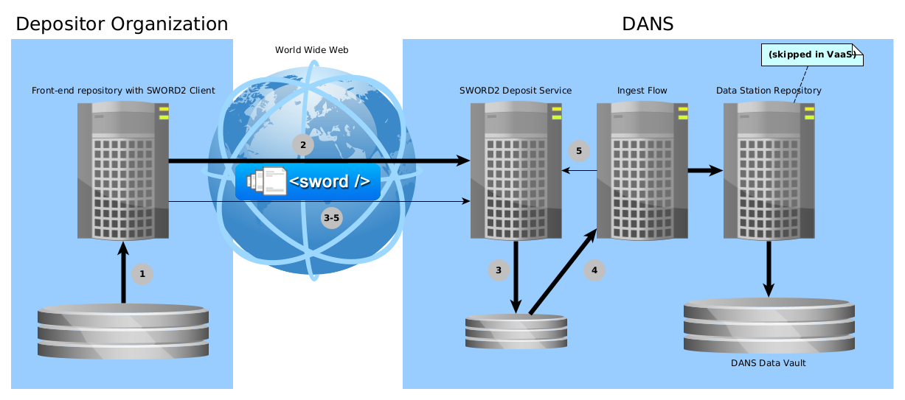

dd-dans-sword2-examples
=======================

Examples for creating a SWORD2 Java client to deposit dataset to a DANS Data Station

SYNOPSIS
--------

```text
mvn clean install
./run.sh ...
```

DESCRIPTION
-----------
This project contains two important resources for developers who are tasked with the creation of maintenance of a SWORD2 client that deposits datasets to one of
the DANS Data Stations (or the DANS Vault Service):

* Java client code
* Examples of bags that conform to the [DANS BagIt Profile v1]{:target=_blank} requirements (and, for illustration, some that violate some of the requirements).

!!! attention "Looking for legacy EASY2 examples?"

    This project contains examples for the SWORD2 interface of the new **DANS Data Stations**. For the _legacy EASY SWORD2 service_ see 
    [easy-sword2-dans-examples]{:target=_blank}. 

### SWORD2 in a nutshell

Depositing to the DANS Archive via SWORD2 is basically a two-phase process:

1. Submitting a deposit for ingest.
2. Tracking the state of the deposit as it goes through the ingest-flow, until it reaches ARCHIVED status.

The following diagram details this a bit further.



1. Client creates a deposit package.
2. Client sends deposit package to SWORD2 Service, getting back a URL to track the deposit's state.
3. SWORD Service unzips and validates deposit.
4. Ingest Flow performs checks and transformations and creates a dataset in the Data Station Repository.
5. Ingest Flow reports back success or failure to SWORD Service.

3-5. During this time the Client periodically checks the deposit state through the URL received in step 2.
If the final state of `ARCHIVED` is reached, the process is concluded successfully. Other outcomes may be `INVALID` (the bag
was [invalid according to the BagIt specs]{:target=_blank})or `REJECTED` (the additional requirements of [DANS BagIt Profile v1]{:target=_blank} were not met).
In case the server encountered an unknown error `FAILED` will be returned.

!!! note "DD SWORD2 service description"

    More detailed information about the SWORD2 can be found [on its manual page]{:target=_blank}

[on its manual page]: {{ dd_sword2_docs }}
[invalid according to the BagIt specs]: https://www.rfc-editor.org/rfc/rfc8493#section-3

### Getting started

The following is a step-by-step instruction on how to run a simple example using the Data Station's demo server.

#### Getting access to the demo server

!!! note "Agreement"

    Before you can get access to the demo server, there must be a formal agreement between your organization and DANS. The following assumes that this agreement 
    is in place. If it is not, please contact the Data Station Manager of the [Data Station](http://dans.knaw.nl){:target=_blank} that you want to deposit to.

1. From your Data Station Manager at DANS request access to the demo Data Station server. The Data Station Manager will provide the information necessary to
   connect.
2. Create an account in the demo Data Station.
3. From your Data Station Manager at DANS request the account to be enabled for SWORD deposits.

!!! note "Configuring which notifications to receive"

    The Data Station repository (Dataverse) generates [notifications]{:target=\_blank} for many events. Most of these can be muted. Log in via the user interface
    and open the account menu on the top right. Click on the _Notifications_ item. The _Notifications_ tab of your _Account_ page will now be opened. Expand the 
    header _Notification settings_ and uncheck the notification types you do not wish to receive.

[notifications]: https://guides.dataverse.org/en/latest/user/account.html#notifications

#### Depositing your first dataset

##### Running the SimpleDeposit example

1. Clone and build this project:

        git clone https://github.com/DANS-KNAW/dd-dans-sword2-examples
        cd dd-dans-sword2-examples
        mvn clean install

3. Execute the following command from the base directory of you clone of this project:

        ./run.sh Simple https://demo.<DS>.datastations.nl/sword2/collection/1 <user> <password> <bag>
   Fill in:

    * for `<DS>` the name of the Data Station that you are depositing to, e.g., `archaeology`;
    * for `<user>` your Data Station account name;
    * for `<password>` the password of your Data Station account;
    * for `<bag>`: any of the bags in `src/main/resources/example-bags`.

##### Output analysis

[In the introduction](#sword2-in-a-nutshell) the SWORD2 deposit process is described in 5 stages, the response messages give some indication how far along the
process is. The output will take the following form, starting with the part of the response representing step 2. The UUID will of course be different.

```text
 SUCCESS. Deposit receipt follows:
 <entry xmlns="http://www.w3.org/2005/Atom">
     <generator uri="http://www.swordapp.org/" version="2.0" />
     <id>https://demo.<DS>.datastations.nl/sword2/container/a5bb644a-78a3-47ae-907a-0bdf162a0cd4</id>
     <link href="https://demo.<DS>.datastations.nl/sword2/container/a5bb644a-78a3-47ae-907a-0bdf162a0cd4" rel="edit" />
     <link href="https://demo.<DS>.datastations.nl/sword2/container/a5bb644a-78a3-47ae-907a-0bdf162a0cd4" rel="http://purl.org/net/sword/terms/add" />
     <link href="https://demo.<DS>.datastations.nl/sword2/media/a5bb644a-78a3-47ae-907a-0bdf162a0cd4" rel="edit-media" />
     <packaging xmlns="http://purl.org/net/sword/terms/">http://purl.org/net/sword/package/BagIt</packaging>
     <link href="https://demo.<DS>.datastations.nl/sword2/statement/a5bb644a-78a3-47ae-907a-0bdf162a0cd4" rel="http://purl.org/net/sword/terms/statement" type="application/atom+xml; type=feed" />
     <treatment xmlns="http://purl.org/net/sword/terms/">[1] unpacking [2] verifying integrity [3] storing persistently</treatment>
     <verboseDescription xmlns="http://purl.org/net/sword/terms/">received successfully: bag.zip; MD5: 494dd614e36edf5c929403ed7625b157</verboseDescription>
 </entry>
 Retrieving Statement IRI (Stat-IRI) from deposit receipt ...
 Stat-IRI = https://demo.<DS>.datastations.nl/sword2/statement/a5bb644a-78a3-47ae-907a-0bdf162a0cd4
```

As the deposit is being processed by the server the client polls the Stat-IRI to track the status of the deposit. During this stage steps 3 and 4 are performed.

```text
 Start polling Stat-IRI for the current status of the deposit, waiting 10 seconds before every request ...
 Checking deposit status ... SUBMITTED
 Checking deposit status ... SUBMITTED
 Checking deposit status ... SUBMITTED
 Checking deposit status ... SUBMITTED
```

The 5th and final step of the process is represented by the following response messaging.

```text
 Checking deposit status ... ARCHIVED
 SUCCESS.
 Deposit has been archived at: <urn:uuid:a5bb644a-78a3-47ae-907a-0bdf162a0cd4>.  With DOI: [10.17026/test-Lwgy-zrn-jfyy]. Dataset landing page will be located at: <https://demo.<DS>.datastations.nl/ui/datasets/id/easy-dataset:24>.
 Complete statement follows:
 <feed xmlns="http://www.w3.org/2005/Atom">
     <id>https://demo.<DS>.datastations.nl/sword2/statement/a5bb644a-78a3-47ae-907a-0bdf162a0cd4</id>
     <link href="https://demo.<DS>.datastations.nl/sword2/statement/a5bb644a-78a3-47ae-907a-0bdf162a0cd4" rel="self" />
     <title type="text">Deposit a5bb644a-78a3-47ae-907a-0bdf162a0cd4</title>
     <author>
         <name>DANS-EASY</name>
     </author>
     <updated>2019-05-23T14:51:15.356Z</updated>
     <category term="ARCHIVED" scheme="http://purl.org/net/sword/terms/state" label="State">http://demo.easy.dans.knaw.nl/ui/datasets/id/easy-dataset:24</category>
     <entry>
         <content type="multipart/related" src="urn:uuid:a5bb644a-78a3-47ae-907a-0bdf162a0cd4" />
         <id>urn:uuid:a5bb644a-78a3-47ae-907a-0bdf162a0cd4</id>
         <title type="text">Resource urn:uuid:a5bb644a-78a3-47ae-907a-0bdf162a0cd4</title>
         <summary type="text">Resource Part</summary>
         <updated>2019-05-23T14:51:22.342Z</updated>
         <link href="https://doi.org/10.5072/dans-Lwgy-zrn-jfyy" rel="self" />
     </entry>
  </feed>
```

##### Statuses

The deposit will go through a number of statuses. The following statuses are possible after sending a SWORD deposit:

|  State       | Description                                                                                                                                                                                                                                                 |
|--------------|-------------------------------------------------------------------------------------------------------------------------------------------------------------------------------------------------------------------------------------------------------------|
| `DRAFT`      | The deposit is being prepared by the depositor. It is not submitted to the archive yet and<br/> still open for additional data.                                                                                                                             |
| `UPLOADED`   | The deposit is in the process of being submitted. It is waiting to be finalized. The data is <br/>completely uploaded. It will automatically move to the next stage and the status will be <br/> updated accordingly.                                       |                                                   
| `FINALIZING` | The deposit is in the process of being submitted. It is being checked for validity. It will automatically move to the next stage and the status will be updated accordingly.                                                                                |                                                  
| `INVALID`    | The deposit is not accepted by the archive as the submitted bag is not valid. The description will detail what part of the bag is not according to specifications. The depositor is asked to fix the bag and resubmit the deposit.                          |                          
| `SUBMITTED`  | The deposit is valid and being processed by the Ingest Flow. It will automatically move to the next stage and the status will be updated accordingly.                                                                                                       |                         
| `REJECTED`   | The deposit does not meet the requirements of the Ingest Flow for its type. The description will detail what part of the deposit is not according to specifications. The depositor is asked to fix and resubmit the deposit.                                |                         
| `FAILED`     | The deposit failed to be archive because of an unexpected condition during the Ingest Flow. DANS monitors the FAILED reports and aims to fix these issues as readily as possible. A following report should typically list the FAILED deposits as ARCHIVED. |  
| `ARCHIVED`   | The deposit is successfully archived in the data vault.                                                                                                                                                                                                     |                                                                                                                                                                                                      

If an error occurs the deposit will end up INVALID, REJECTED (client error) or FAILED (server error).
The text of the `category` element will contain details about the state.

### Next steps

#### Creating test data

The easy-sword2 service requires deposits to be sent as zipped bags (see [BagIt]). The EASY archive adds some extra requirements.
These are documented in the [DANS BagIt Profile]. A command line tool called [xmllint] can be used to validate xml files locally.

##### Pre-made examples

Some examples of bags which meet the specifications of the SWORD depositing interface can be found in the [resources directory].
These bags are categorized by the flow which they are designed for. You can use these as starting points for you test data or start a
new bag from scratch (see next section).

##### Creating your own examples

To upload a dataset it must be properly formatted. Some example bags can be found in the [resources directory], as well as the specifications the bags must
follow.
A dataset can be created by performing the following steps. For this you will need the `bagit` command line tool which is only available on MacOS and can be
installed
through the `brew` command. See [this blog post](https://patchbay.tech/2018/03/14/getting-started-with-bagit-in-2018/) for a list of other BagIt tools.

1. Run `mkdir my-bag; mkdir my-bag/data; mkdir my-bag/metadata; bagit baginplace my-bag` to create the bag
2. Place the data files in the `my-bag/data` directory
3. Create the `my-bag/metadata/dataset.xml` and `my-bag/metadata/files.xml` add the appropriate metadata. See [DANS BagIt Profile] and the pre-made examples for
   guidance about what constitutes appropriate metadata.
4. Update the `my-bag/bag-info.txt` to include the Created date: `Created: yyyy-mm-ddThh:mm:ss.000+00:00`
5. Update the checksums with `bagit makecomplete my-bag my-bag --payloadmanifestalgorithm SHA1`
6. verify that the bag is valid according to Bagit with `bagit verifyvalid my-bag`

#### Testing different scenarios

This project contains 4 [Java example programs] which can be used as a guide to writing a custom client to deposit datasets using the SWORD2 protocol.
The examples take one or more bags as input parameters. These bags may be directories or ZIP files.
The code copies each bag to the `target`-folder of the project, zips it (if necessary) and sends it to the specified SWORDv2 service.
The copying step has been built in because in some examples the bag must be modified before it is sent.

1. `SimpleDeposit.java` sends a zipped dataset in a single chunk and reports on the status.
2. `ContinuedDeposit.java` sends a zipped bag in chunks of configurable size and reports on the status.
3. `SequenceSimpleDeposit.java` calls the SimpleDeposit class multiple times to send multiple bags belonging to a sequence.
4. `SequenceContinuedDeposit.java` calls the ContinuedDeposit class multiple times to send multiple bags belonging to a sequence.

The `Common.java` class contains elements which are used by all the other classes. This would include parsing, zipping and sending of files.

The project directory contains a `run.sh` script that can be used to invoke the Java programs. For example:

    mvn clean install # Only necessary if the code was not previously built.
    ./run.sh Simple https://demo.<DS>.datastations.nl/sword2/collection/1 myuser mypassword bag
    ./run.sh Continued https://demo.<DS>.datastations.nl/sword2/collection/1 myuser mypassword chunksize bag
    ./run.sh SequenceSimple https://demo.<DS>.datastations.nl/sword2/collection/1 myuser mypassword bag1 bag2 bag3
    ./run.sh SequenceContinued https://demo.<DS>.datastations.nl/sword2/collection/1 myuser mypassword chunksize bag1 bag2 bag3

### DANS reports

DANS sends out e-mails concerning the status of the deposits both in the deposit area and the DANS archives.

`DOI report for prefix <prefix>`

* `<prefix>-doi-report-<date>.csv`: An overview of all the doi with this prefix in the DANS archives.

`DANS-EASY Error report: status of failed EASY deposits` this e-mail contains two reports about failed deposits:

* `DANS-EASY-report-error-yesterday-<date>.csv`: A deposit-report with all the FAILED / REJECTED / INVALID deposits of the last day.
* `DANS-EASY-report-error-<date>.csv`: A deposit-report with all the failed deposits that are in the deposit area. In case a `REJECTED` deposit has been resend,
  the old one is still mentioned here.

`DANS-EASY Report: status of EASY deposits`, An e-mail with reports on all deposits in the deposit area:

* `DANS-EASY-report-full-yesterday-<date>.csv`: A deposit-report containing all the deposits made in the last day, both `ARCHIVED` and otherwise.
* `DANS-EASY-report-summary-<date>.txt`: A summary of the data that's being held in the deposit area, split into the different Statuses
* `DANS-EASY-report-summary-yesterday-<date>.txt`: A summary of the data that's being added to the deposit area in the last day, split into the different
  Statuses.

The deposit-reports are csv files with the following columns:

| column                     | description                                                                               |
|----------------------------|-------------------------------------------------------------------------------------------|
| DEPOSITOR                  | the account name of the depositor                                                         |
| DEPOSIT_ID                 | the UUID under which the deposit is registered at DANS-EASY                               |
| BAG_NAME                   | the directory name of the bag                                                             |
| DEPOSIT_STATE              | the state of the deposit, see the `Statuses` for possible values                          |
| ORIGIN                     | the source of the deposit, either SWORD or an internal source                             |
| LOCATION                   | the current location of the deposit                                                       |
| DANS_DOI                   | the DOI that DANS-EASY assigns to the deposit, if any                                     |
| ORGANIZATIONAL_ID          | the organizational identifier given by the depositor in the bag-info.txt, if any          |
| DOI_REGISTERED             | whether the DANS_DOI has been registered at Datacite                                      |
| FEDORA_ID                  | the identifier of the deposit in the web interface.                                       |
| DATAMANAGER                | the name of the datamanager assigned to the deposit, or `n/a` otherwise                   |
| DEPOSIT_CREATION_TIMESTAMP | the `Created` timestamp as given in the bag-info.txt                                      |
| DEPOSIT_UPDATE_TIMESTAMP   | the timestamp of the last update on this deposit during the ingest into the DANS archive  |
| DESCRIPTION                | a description of the current state of the deposit. To be used together with DEPOSIT_STATE |
| NBR_OF_CONTINUED_DEPOSITS  | the number of packages received for this deposit so far                                   |
| STORAGE_IN_BYTES           | the amount of data stored in the deposit area for this deposit                            |

[Java Example programs]: {{ dd_dans_sword2_examples_base_url }}/tree/master/src/main/java/nl/knaw/dans/sword2examples

[resources directory]: {{ dd_dans_sword2_examples_base_url }}/tree/master/src/main/resources

[BagIt]: https://datatracker.ietf.org/doc/draft-kunze-bagit

[DANS BagIt Profile v1]: {{ dans_bagit_profile }}

[xmllint]: http://xmlsoft.org/xmllint.html

[SWORD v2.0 protocol]: http://swordapp.org/sword-v2/


[easy-sword2-dans-examples]: https://github.com/DANS-KNAW/easy-sword2-dans-examples


EXAMPLES
--------


